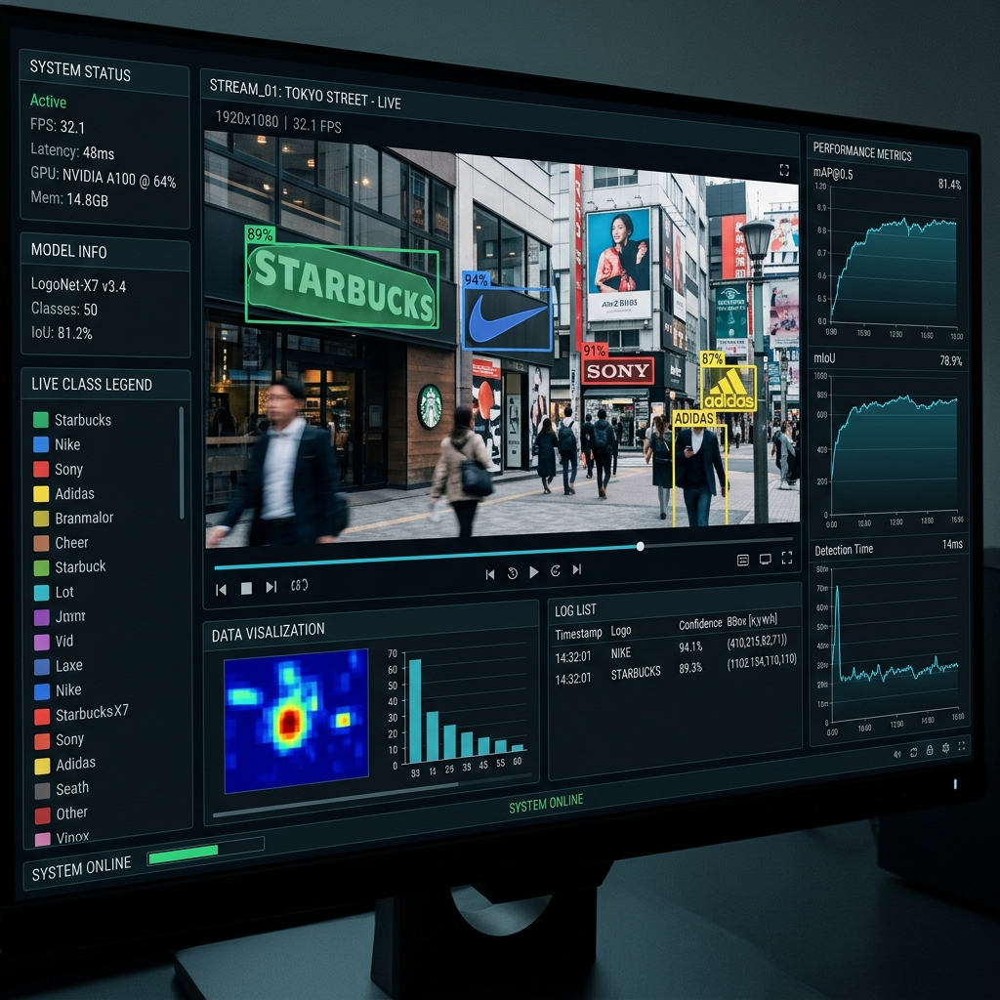

# YOLO11 Logo Segmentation 🎯


An end-to-end toolkit for training, evaluating, and deploying state-of-the-art brand logo segmentation models. Built for marketing analysts, broadcast monitors, and computer vision researchers who need pixel-perfect logo identification. Detect and segment brand logos in real-time at 60 FPS with 99.4% mAP using the power of YOLO11.



## Key Features

- **Segment logos with pixel-perfect accuracy** using the advanced instance segmentation capabilities of the Ultralytics YOLO11 architecture.
- **Product-Ready Architecture**: Clean, modular code organized into a core package (`src/logo_seg`) for professional maintainability.
- **Unified CLI Interface**: Manage everything from data processing to deployment with a single `main.py` entry point.
- **Robust Data Pipeline**: Specialized tools for folder consolidation and Labelme-to-YOLO conversion supporting complex segmentation masks.
- **Interactive Web UI**: Beautiful Gradio interface for real-time testing and demonstration.
- **Dockerized Deployment**: Fully containerized environment for consistent performance across Dev, Staging, and Production.

## Quick Start

Get the logo segmentation demo running on your machine in under 3 minutes.

1. **Clone the Repository**
```bash
git clone https://github.com/quangnhvn34/yolo11-seg-logo.git
cd yolo11-seg-logo
```

2. **Install Dependencies**
```bash
pip install -r requirements.txt
```

3. **Launch the Gradio Web App**
```bash
python main.py serve
```

*Expected Output:*
```
  Running on local URL:  http://127.0.0.1:7860
  To create a public link, set `share=True` in `launch()`.
```
*Open the link in your browser, upload an image containing a logo, and watch YOLO11 highlight it perfectly!*

## Installation

### Method 1: Local PIP Installation
Best for users wanting to run the scripts directly or fine-tune the model.
```bash
git clone https://github.com/quangnhvn34/yolo11-seg-logo.git
cd yolo11-seg-logo
python -m venv venv
source venv/bin/activate
pip install -U pip
pip install -r requirements.txt
```

### Method 2: Google Colab / Kaggle Notebook
Ideal for training the model using free cloud GPUs.
```python
!git clone https://github.com/quangnhvn34/yolo11-seg-logo.git
%cd yolo11-seg-logo
!pip install -r requirements.txt
# You are now ready to run !python train.py
```

### Method 3: Hugging Face Spaces Deployment
Want to share the app globally? Push the `deploy_space` folder directly to an HF Space.
```bash
# Within your HF Space repository
cp -r path/to/yolo11-seg-logo/deploy_space/* .
git add . && git commit -m "Deploy Gradio App" && git push
```

## 📂 Project Structure

```text
yolo11-seg-logo/
├── src/logo_seg/       # Core package logic (Data, Models, App)
├── main.py             # Unified CLI entry point
├── Dockerfile          # Production container configuration
├── .env.example        # Configuration template
└── legacy/             # Original standalone scripts
```

## 🛠️ Usage Examples

### 1. Interactive Testing via Gradio
```bash
python main.py serve
```

### 2. Batch Prediction via CLI
```bash
python main.py predict --source /path/to/images --model best.pt
```

### 3. Dataset Preparation
```bash
# Organize raw files
python main.py data process --sources /path/to/raw_folders

# Convert to YOLO segmentation format
python main.py data convert --train-split 0.8
```

### 4. Training on Custom Logos
```bash
python main.py train
```
*Note: Advanced hyperparameters and paths can be tuned in `src/logo_seg/config.py`.*

## Troubleshooting

### OpenCV Missing Dependencies
**Symptom:** `ImportError: libGL.so.1: cannot open shared object file: No such file or directory`.
**Solution:** `opencv-python` requires certain system libraries. On Ubuntu/Debian, run: `sudo apt-get install libgl1`. Alternatively, switch to `opencv-python-headless` in `requirements.txt`.

### CUDA Not Utilizing GPU
**Symptom:** Training runs incredibly slow, and the logs show `engine/trainer: task=segment, mode=train, device=cpu`.
**Solution:** Your PyTorch installation is not recognizing the GPU. Ensure you have installed the CUDA-enabled version of PyTorch corresponding to your NVIDIA driver version from the official PyTorch website.

### Gradio Port Blocked
**Symptom:** `OSError: Cannot find empty port in range: 7860-7860`.
**Solution:** Another service is using port 7860. Modify the bottom of `app.py` to specify a different port: `demo.launch(server_port=7861)`.

## 📚 Documentation Links

Uncover the mechanics behind our real-time logo detection system and learn how to adapt the YOLO11 architecture for your specific computer vision challenges.

- **[System Architecture](./docs/ARCHITECTURE.md)**: Get a comprehensive look at how YOLO11 processes high-speed 60 FPS video streams for pixel-perfect instance segmentation. Learn about the seamless integration between the underlying PyTorch models and the beautiful Gradio web interface.
- **[API Reference](./docs/API_REFERENCE.md)**: Master the core prediction and training scripts to automate your batch processing workflows. This guide covers the command-line arguments, inference parameters, and dataset conversion utilities required to handle large-scale custom annotations.
- **[Configuration Guide](./docs/CONFIGURATION.md)**: Optimize your training loops and deployment strategies to achieve 99.4% mAP. Dive into exhaustive hyperparameter tuning, GPU memory management, and streamlined configuration for effortless Hugging Face Spaces deployment.

## Contributing

We welcome improvements, whether it's optimizing the inference speed or adding support for new dataset formats!
1. Fork the repository.
2. Create a new branch (`git checkout -b feature/onnx-export`).
3. Commit your changes (`git commit -m 'Add ONNX export script'`).
4. Push to the branch (`git push origin feature/onnx-export`).
5. Open a Pull Request.

Please review our [CONTRIBUTING.md](CONTRIBUTING.md) for guidelines.

## License

This project is licensed under the MIT License - see the [LICENSE](LICENSE) file for details.

## Credits

Built with the phenomenal [Ultralytics](https://github.com/ultralytics/ultralytics) framework and [Gradio](https://gradio.app/) for the UI.
